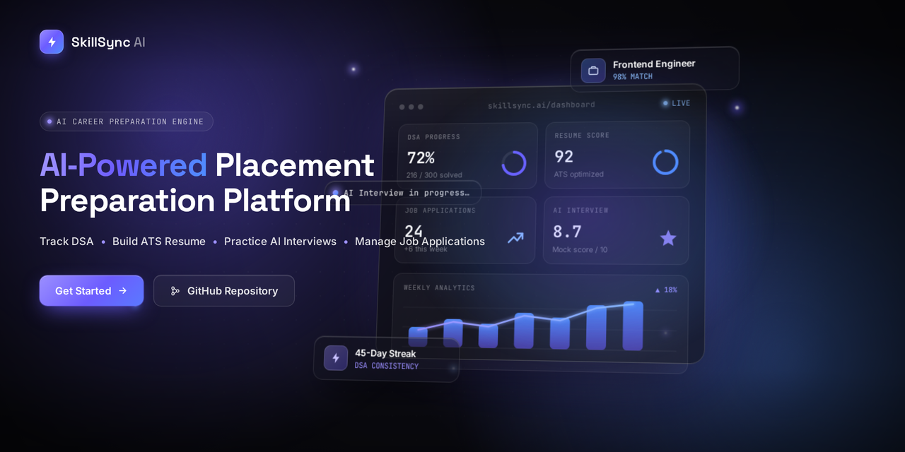
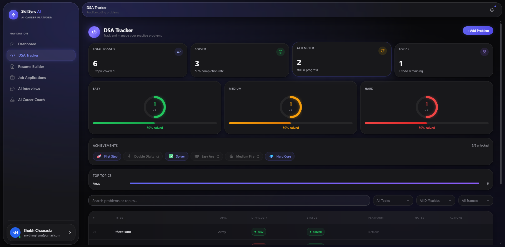
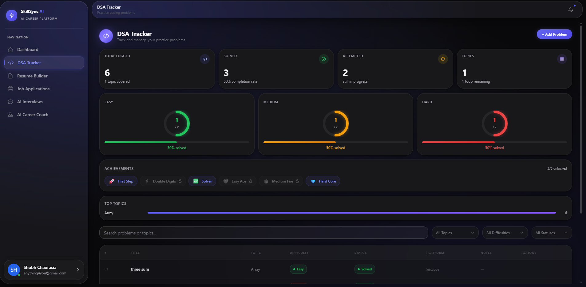
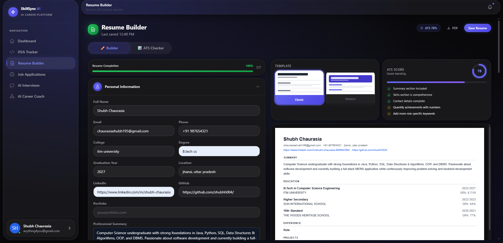
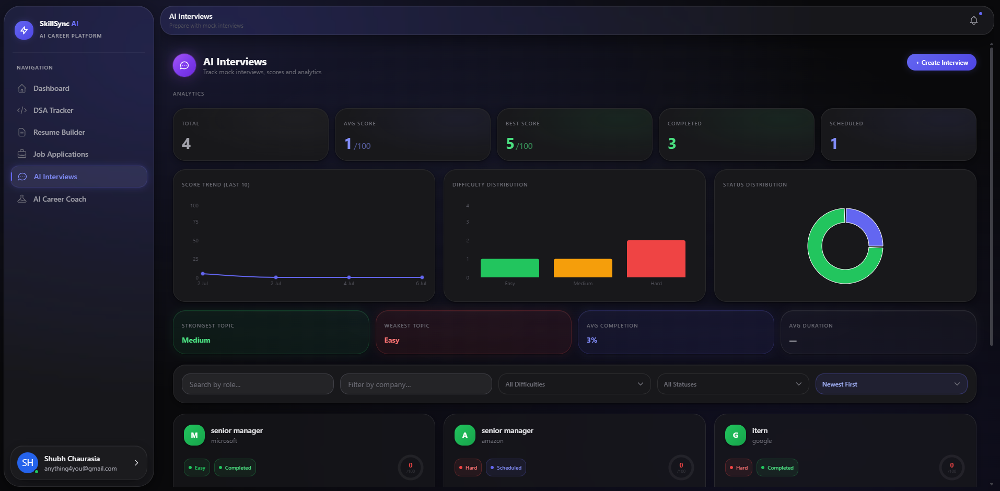
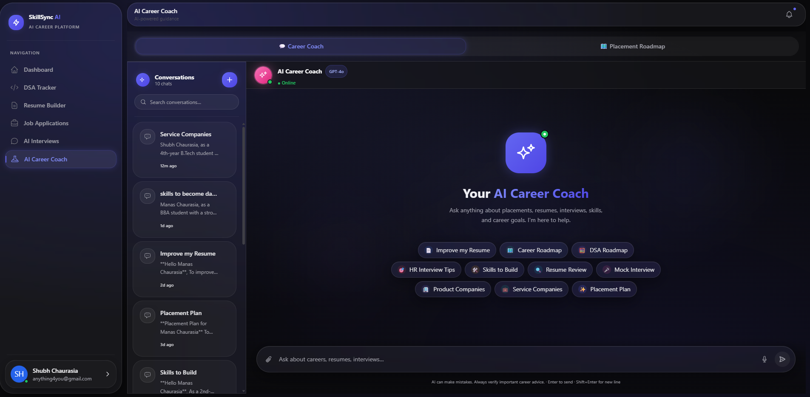

# ⚡ SkillSync AI

**AI Powered Placement Preparation Platform**

SkillSync AI is a full-stack, AI-powered platform built to help students prepare for campus and off-campus placements. It brings together DSA progress tracking, ATS-optimised resume building, AI-driven mock interviews, job application management, and a personalised AI career coach — all inside a single, premium workspace.

---

[](LICENSE)
[](https://react.dev)
[](https://nodejs.org)
[](https://expressjs.com)
[](https://mongodb.com)
[](https://jwt.io)
[](https://tailwindcss.com)
[](https://vitejs.dev)

---

## ✨ Features

- ✔ **Dashboard** — Unified overview of progress, streaks, and upcoming tasks
- ✔ **DSA Tracker** — Topic-wise problem tracking with difficulty filters and completion stats
- ✔ **ATS Resume Builder** — Build and export ATS-friendly resumes with a live preview editor
- ✔ **Job Tracker** — Manage job applications with status labels, deadlines, and notes
- ✔ **AI Mock Interview** — Simulated technical and HR interviews powered by AI
- ✔ **AI Career Coach** — Personalised career guidance, skill roadmaps, and actionable feedback
- ✔ **Analytics** — Visual progress charts and performance insights across all modules
- ✔ **Authentication** — Secure JWT-based sign up, login, and session management
- ✔ **Responsive Design** — Fully optimised for desktop, tablet, and mobile

---

## 📸 Screenshots

| Landing Page | Dashboard | DSA Tracker |
| :---: | :---: | :---: |
|  |  |  |

| Resume Builder | Job Tracker | AI Interview |
| :---: | :---: | :---: |
|  |  |  |

| Career Coach |
| :---: |
|  |

---

## 🛠 Tech Stack

| Layer | Technology |
| --- | --- |
| **Frontend** | React 18, Vite 5, Tailwind CSS 3 |
| **Backend** | Node.js 20, Express 4 |
| **Database** | MongoDB, Mongoose ODM |
| **Authentication** | JSON Web Tokens (JWT), bcryptjs |
| **AI Integration** | Grok API |
| **State Management** | React Context API |
| **Charts** | Recharts |
| **Icons** | Lucide React |
| **Deployment** | Vercel (client), Render (server) |

---

## 📂 Folder Structure

```
skillsync-ai/
├── client/                    # React frontend (Vite)
│   ├── public/
│   └── src/
│       ├── components/        # Reusable UI components
│       ├── pages/             # Route-level page components
│       ├── context/           # Global state and auth context
│       ├── hooks/             # Custom React hooks
│       ├── services/          # API service layer
│       └── utils/             # Helper utilities
├── server/                    # Express backend (Node.js)
│   ├── controllers/           # Route handler logic
│   ├── middleware/            # Auth and error middleware
│   ├── models/                # Mongoose data models
│   ├── routes/                # API route definitions
│   └── utils/                 # Server-side utilities
├── assets/                    # Logo, banner, and screenshots
├── docs/                      # Additional documentation
└── README.md
```

---

## 🚀 Installation

**Prerequisites:** Node.js 18+, MongoDB (local or Atlas)

**1. Clone the repository**

```bash
git clone https://github.com/shubhh004/skillsync-ai.git
cd skillsync-ai
```

**2. Install client dependencies**

```bash
cd client
npm install
```

**3. Install server dependencies**

```bash
cd ../server
npm install
```

**4. Configure environment variables**

Create `.env` files as described in the [Environment Variables](#-environment-variables) section below.

**5. Start the development servers**

Open two terminals and run each separately:

```bash
# Terminal 1 — client
cd client
npm run dev

# Terminal 2 — server
cd server
npm run dev
```

The client runs on `http://localhost:5173` and the server on `http://localhost:5000`.

---

## 🔑 Environment Variables

**Client — `client/.env`**

```env
VITE_API_BASE_URL=http://localhost:5000/api
VITE_APP_NAME=SkillSync AI
```

**Server — `server/.env`**

```env
PORT=5000
MONGO_URI=your_mongodb_connection_string
JWT_SECRET=your_jwt_secret_key
JWT_EXPIRES_IN=7d
GEMINI_API_KEY=your_google_gemini_api_key
CLIENT_URL=http://localhost:5173
NODE_ENV=development
```

> Never commit `.env` files. Ensure both are listed in `.gitignore` before pushing.

---

## 🎯 Roadmap

**Completed**

- [x] User Authentication (JWT)
- [x] Dashboard
- [x] Landing Page
- [x] DSA Tracker
- [x] ATS Resume Builder
- [x] Job Tracker
- [x] AI Mock Interview
- [x] AI Career Coach
- [x] Responsive UI — mobile and tablet
- [x] Production polish and design system

**Upcoming**

- [ ] In-app notification system
- [ ] Real-time AI interview evaluation and scoring
- [ ] Email automation — welcome emails, reminders
- [ ] Admin panel
- [ ] Calendar integration for interview scheduling
- [ ] Resume version history

---

## 🤝 Contributing

Contributions are welcome. To get started:

1. Fork this repository
2. Create a new branch for your feature

```bash
git checkout -b feature/your-feature-name
```

3. Commit your changes with a clear message

```bash
git commit -m "feat: describe your change"
```

4. Push the branch and open a Pull Request

```bash
git push origin feature/your-feature-name
```

Please follow the existing code style and test your changes before submitting. For larger changes, open an issue first to discuss the proposed approach.

---

## 📜 License

This project is licensed under the [MIT License](LICENSE).

---

Made with love by [Shubh Chaurasia](https://github.com/shubhh004)
