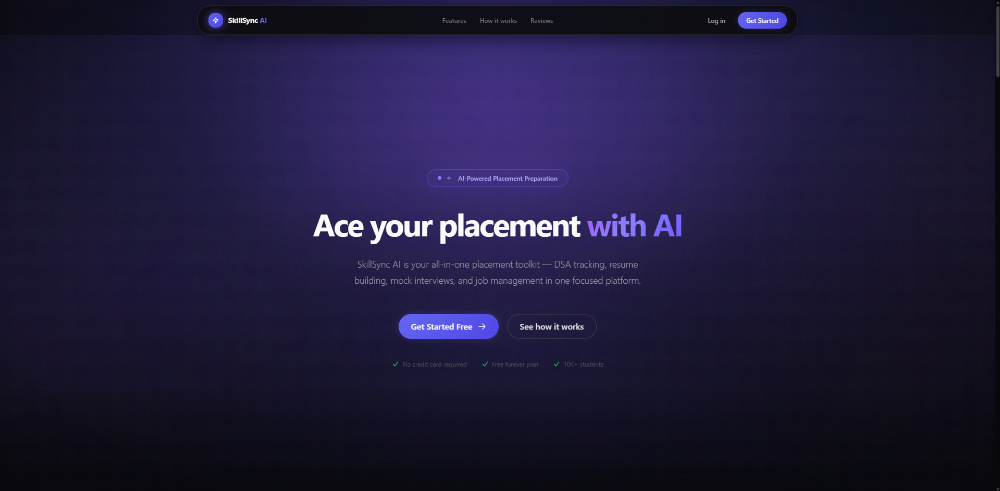
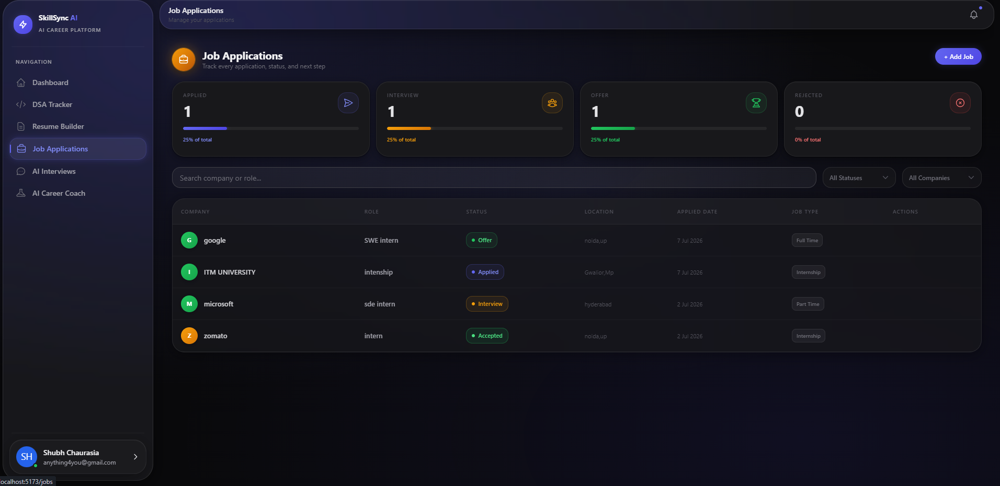
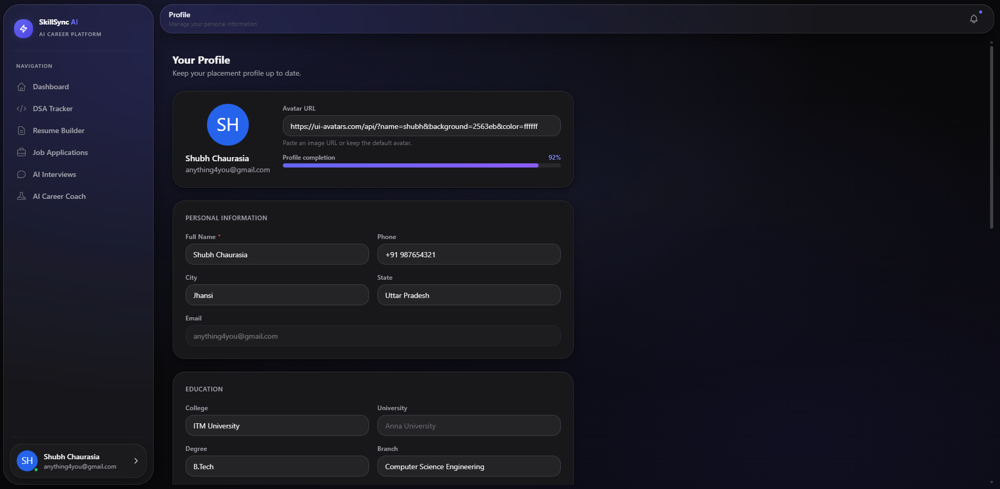

<div align="center">


# ⚡ SkillSync AI

### AI Powered Placement Preparation Platform

SkillSync AI is a full-stack, AI-driven platform that helps students go from preparation to placement. It combines DSA progress tracking, ATS resume building, AI mock interviews, job application management, and a personalised AI career coach — all in one premium, responsive workspace.

<br />

[](LICENSE)
[](https://react.dev)
[](https://nodejs.org)
[](https://expressjs.com)
[](https://mongodb.com)
[](https://jwt.io)
[](https://tailwindcss.com)
[](https://vitejs.dev)

</div>

---

## ✨ Features

| Feature | Description |
| --- | --- |
| 🤖 **AI Career Coach** | Personalised career guidance, skill gap analysis, and AI-curated advice |
| 📊 **DSA Progress Tracker** | Topic-wise problem tracking with difficulty filters, tags, and streaks |
| 📄 **ATS Resume Builder** | Build, customise, and export ATS-optimised resumes with live preview |
| 🎤 **AI Mock Interviews** | Simulated technical and HR interviews with AI-generated questions |
| 💼 **Job Tracker** | Manage applications with status labels, deadlines, and company notes |
| 📈 **Analytics Dashboard** | Visual progress charts and performance insights across all modules |
| 🗺️ **Personalized Roadmap** | AI-curated learning paths tailored to your skills and target role |
| 🔐 **Authentication** | Secure sign up, login, and JWT-based session management |
| 📱 **Responsive UI** | Fully optimised interface for desktop, tablet, and mobile |

---

## 🛠 Tech Stack

| Layer | Technologies |
| --- | --- |
| **Frontend** | React 18 · Tailwind CSS 3 · Vite 5 · Framer Motion |
| **Backend** | Node.js 20 · Express 4 |
| **Database** | MongoDB · Mongoose |
| **Authentication** | JSON Web Tokens (JWT) · bcryptjs |

---

## 📸 Screenshots

### Landing Page

Modern glassmorphism-inspired landing page showcasing the complete placement preparation ecosystem.



---

### Dashboard

Unified command center displaying DSA progress, active job applications, and upcoming interview sessions at a glance.


---

### DSA Tracker

Topic-wise DSA problem tracker with difficulty filters, completion status, and streak tracking across all major categories.


---

### Resume Builder

ATS-optimised resume builder with live preview, customisable sections, and one-click PDF export.


---

### AI Interview

AI-powered mock interview simulator with real-time question generation for both technical and HR rounds.


---

### Career Coach

Personalised AI career coach delivering skill gap analysis, curated learning roadmaps, and actionable guidance.


---

### Job Tracker

Full job application pipeline with status labels, company notes, deadlines, and progress tracking in one view.



---

### Profile

User profile with account settings, placement goal configuration, and a personal progress summary.



---

## 📂 Folder Structure

```
skillsync-ai/
├── client/                    # React frontend (Vite)
│   ├── public/
│   └── src/
│       ├── components/        # Reusable UI components
│       ├── pages/             # Route-level page components
│       ├── context/           # Global state and auth context
│       ├── hooks/             # Custom React hooks
│       ├── services/          # API service layer
│       └── utils/             # Helper utilities
├── server/                    # Express backend (Node.js)
│   ├── controllers/           # Route handler logic
│   ├── middleware/            # Auth and error middleware
│   ├── models/                # Mongoose data models
│   ├── routes/                # API route definitions
│   └── utils/                 # Server-side utilities
├── assets/                    # Logo, banner, and screenshots
├── docs/                      # Documentation
└── README.md
```

---

## 🚀 Installation

**Prerequisites:** Node.js 18+, MongoDB (local or Atlas)

**1. Clone the repository**

```bash
git clone https://github.com/shubhh004/skillsync-ai.git
cd skillsync-ai
```

**2. Install dependencies**

```bash
# Client
cd client && npm install

# Server
cd ../server && npm install
```

**3. Configure environment variables**

Create `.env` files as described in the [Environment Variables](#-environment-variables) section below.

**4. Start the development servers**

```bash
# Terminal 1 — Client (localhost:5173)
cd client && npm run dev

# Terminal 2 — Server (localhost:5000)
cd server && npm run dev
```

---

## 🔑 Environment Variables

**`server/.env`**

```env
MONGODB_URI=your_mongodb_connection_string
JWT_SECRET=your_jwt_secret_key
CLIENT_URL=http://localhost:5173
GEMINI_API_KEY=your_gemini_api_key
```

**`client/.env`**

```env
VITE_API_BASE_URL=http://localhost:5000/api
```

> Never commit `.env` files. Add both to `.gitignore` before pushing.

---

## 🎯 Roadmap

**Completed**

- [x] User Authentication (JWT)
- [x] Landing Page
- [x] Dashboard
- [x] DSA Progress Tracker
- [x] ATS Resume Builder
- [x] Job Tracker
- [x] AI Mock Interviews
- [x] AI Career Coach
- [x] Personalized Roadmap
- [x] Analytics Dashboard
- [x] Responsive UI — mobile and tablet
- [x] Production polish and design system

**Upcoming**

- [ ] In-app notification system
- [ ] Real-time AI interview evaluation and scoring
- [ ] Email automation — welcome emails and reminders
- [ ] Admin panel
- [ ] Calendar integration for interview scheduling
- [ ] Resume version history

---

## 🤝 Contributing

Contributions are welcome. To get started:

1. Fork this repository
2. Create a feature branch

```bash
git checkout -b feature/your-feature-name
```

3. Commit your changes

```bash
git commit -m "feat: describe your change"
```

4. Push and open a Pull Request

```bash
git push origin feature/your-feature-name
```

For major changes, open an issue first to discuss your proposal before submitting a PR.

---

## 📜 License

Distributed under the [MIT License](LICENSE).

---

## 👤 Author

**Shubh Chaurasia**

- GitHub — [@shubhh004](https://github.com/shubhh004)

---

Made with ❤️ by [Shubh Chaurasia](https://github.com/shubhh004)
